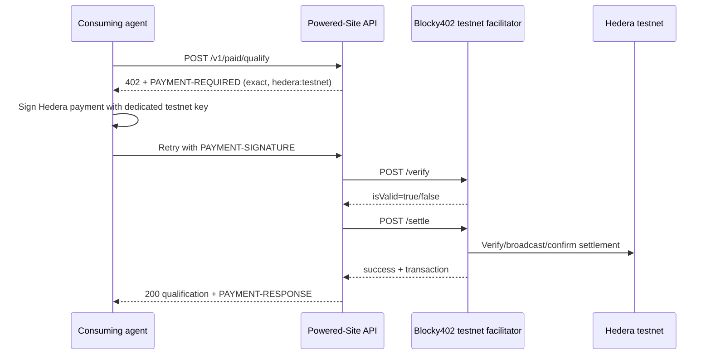

# Hedera x402 implementation and approval gate

## Current official requirements

The current ETHOnline 2026 Hedera AI & Agentic Payments bounty requires a live x402-gated service on Hedera testnet or mainnet settled through Blocky402, a consuming platform or agent completing at least one real paid request, a public GitHub repository with setup/architecture/payment-flow documentation, and a demo video of five minutes or less. This project will use Hedera testnet only.

References:

* ETHGlobal: <https://ethglobal.com/events/ethonline2026/prizes/hedera>
* x402 protocol: <https://github.com/x402-foundation/x402>
* Official Hedera x402 mechanism: <https://github.com/x402-foundation/x402/tree/main/typescript/packages/mechanisms/hedera>
* Hedera reference implementation: <https://github.com/hedera-dev/x402-hedera>
* Blocky402 API: <https://blocky402.com/docs/api-reference/>
* Blocky402 testnet guide: <https://blocky402.com/docs/quickstart/>

## Architecture



The existing unpaid `POST /v1/qualify` remains unchanged. The paid route is `POST /v1/paid/qualify`.

## Implementation status

Implemented locally:

* x402 v2 `402 Payment Required` response and base64 `PAYMENT-REQUIRED` header.
* Hedera `exact` / `hedera:testnet` requirements using native HBAR (`0.0.0`) by default.
* Accepts `PAYMENT-SIGNATURE` and `X-PAYMENT` payment headers.
* Remote mode posts the canonical v2 envelope to Blocky402 `/verify` and `/settle`.
* Local-only mock mode requires the explicit marker `mock: local-test-only` and performs no network or blockchain activity.
* Python protocol client for mock flow and a Node client using the official `@x402/hedera` signer path for the future approved testnet run.

The configured default amount is `100000` tinybars, or `0.001 HBAR`, but no real or testnet payment has been attempted.

## Wallet/account requirement — approval gate

Before a real testnet request, two dedicated Hedera ECDSA testnet accounts are required by the reference flow:

1. Buyer/client account: signs the payment payload and pays the testnet amount/fees.
2. Seller/pay-to account: receives the payment; its account ID is `X402_PAY_TO`.

The hosted Blocky402 testnet facilitator also advertises a fee-payer account in `GET /supported`; matching `extra.feePayer` must be in the payment requirements. The service does not need the buyer private key. The buyer key is needed only by the consuming agent.

Required secrets and storage after approval:

* `HEDERA_CLIENT_PRIVATE_KEY`: buyer ECDSA testnet private key, supplied only as a protected runtime environment variable to the consuming agent; never committed or logged.
* `HEDERA_CLIENT_ACCOUNT_ID`: buyer account ID; non-secret configuration.
* `X402_PAY_TO`: seller account ID; non-secret configuration.
* `X402_FEE_PAYER`: facilitator-advertised fee payer; non-secret configuration.

The service itself should not hold a buyer private key. The project currently has no account, wallet, private key, `.env`, or external registration.

## Faucet and funds

Testnet HBAR from the Hedera Portal faucet is sufficient for a minimal native-HBAR proof, subject to current faucet availability and account limits. It has no intended financial value. The official Hedera x402 reference also documents a Circle testnet faucet for test USDC, but USDC requires token association; native HBAR is the simpler first proof.

No real funds should be required for a Hedera testnet proof. Blocky402 documents that its hosted testnet API is open access with no API key; mainnet API-key requirements do not apply to this testnet-only plan.

## Consuming-agent instructions

Mock-only local flow:

```bash
X402_MODE=mock X402_PAY_TO=0.0.1234 .venv/bin/python agent/consume.py examples/site-ready.json
```

Approved real testnet flow, not executed:

```bash
cd agent
corepack pnpm install --frozen-lockfile
HEDERA_CLIENT_ACCOUNT_ID=0.0.x \
HEDERA_CLIENT_PRIVATE_KEY='[protected runtime value]' \
SERVICE_URL='https://approved-service.example/v1/paid/qualify' \
node consume.mjs ../examples/site-ready.json
```

The real flow must use a protected secret store or process environment, must not print the key, and must preserve request/402/sign/retry/result evidence. The command above must not be run until the approval gate is cleared.

## Evidence structure

```text
evidence/
├── README.md
├── local-mock/
│   ├── initial-402.json
│   ├── retry-result.json
│   └── test-log.txt
└── hedera-testnet/              # empty until explicitly approved
    ├── initial-402.json
    ├── payment-response-redacted.json
    ├── qualification-result.json
    ├── transaction-id.txt
    └── run-metadata.json
```

Never store private keys, signed payloads, access tokens, or unredacted personal data in evidence.

## Bounty checklist

- [x] Existing qualification API retained.
- [x] x402 v2 payment boundary implemented.
- [x] Explicit Hedera testnet configuration.
- [x] Local mock payment flow and consuming client.
- [x] Real Hedera client path using `@x402/hedera`.
- [ ] Dedicated buyer and seller testnet accounts approved and created.
- [ ] Testnet HBAR obtained from faucet.
- [ ] Blocky402 `GET /supported` checked immediately before run.
- [ ] One real paid request settled on Hedera testnet.
- [ ] Redacted transaction/payment evidence captured.
- [ ] Public service deployed.
- [ ] Public GitHub repository and README finalized.
- [ ] Five-minute-or-less demo recorded.
- [ ] External submission authorized and completed.
